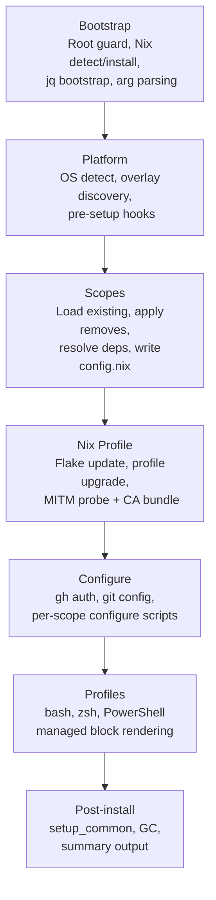
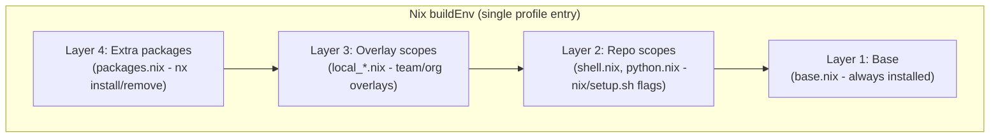
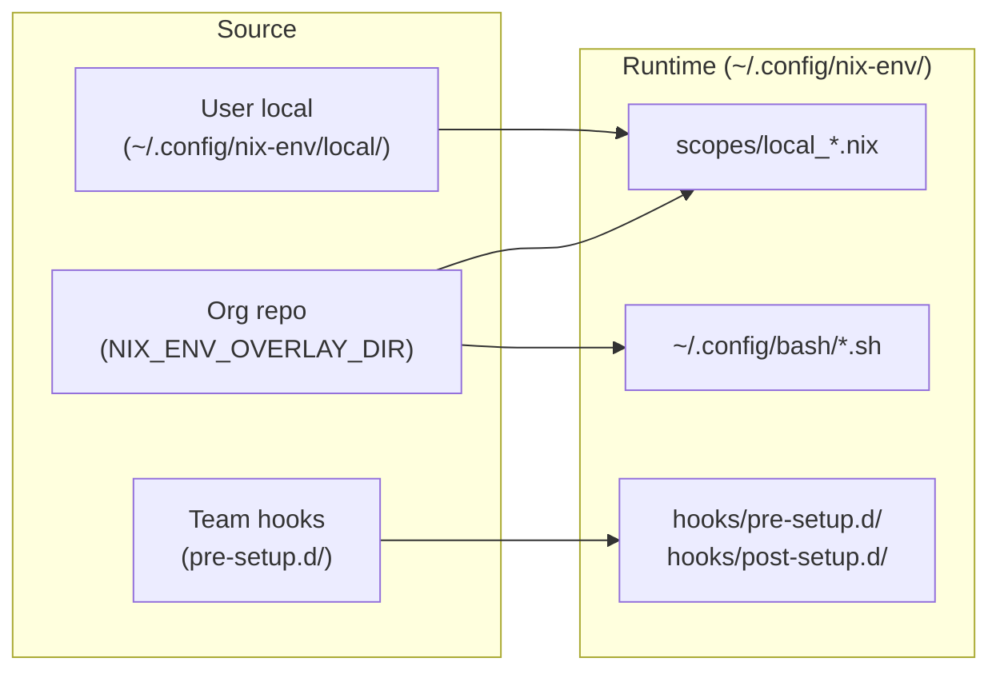

# Architecture

This page provides a condensed view of the system's design - how the phases connect, where state lives, and how the extensibility model works. For the full implementation reference, see [ARCHITECTURE.md](https://github.com/szymonos/linux-setup-scripts/blob/main/ARCHITECTURE.md) in the repository.

## Setup paths

| Path          | Entry point                      | Platforms                | Requirements                    |
| ------------- | -------------------------------- | ------------------------ | ------------------------------- |
| Nix (primary) | `nix/setup.sh`                   | macOS, Linux, WSL, Coder | User-scope, bash 3.2 compatible |
| Legacy        | `.assets/scripts/linux_setup.sh` | Linux                    | Root, bash 4+                   |
| WSL           | `wsl/wsl_setup.ps1`              | Windows host             | Admin, PowerShell 7.4+          |

The Nix path is the recommended entry point for all platforms. It runs entirely in user scope after the one-time Nix installation and works identically on macOS (including bash 3.2 and BSD sed), Linux, WSL, and rootless container environments.

## Phase pipeline

`nix/setup.sh` is a slim orchestrator (~110 lines) that sources phase libraries and executes them in sequence. Each phase is a separate file with documented inputs and outputs.

Side-effecting operations (nix commands, git clones, curl probes) are called through thin wrappers defined in `io.sh`. Tests override these wrappers to assert behaviour without executing real side effects - no mocking frameworks needed.

## Package composition

Packages are assembled from four layers, evaluated bottom-up by the Nix flake. Each layer serves a different purpose and audience:

All four layers merge into a single `buildEnv` - one nix profile entry, one `nix profile upgrade` to apply. No layer can shadow or break another.

## Durable state

After setup, all state lives in the user's home directory. The repository clone is disposable.

| Location                         | Purpose                            | Managed by                          |
| -------------------------------- | ---------------------------------- | ----------------------------------- |
| `~/.config/nix-env/`             | Flake, scopes, config, theme files | `nix/setup.sh`, `nx` CLI            |
| `~/.config/bash/`                | Shell aliases and functions        | `nix/configure/profiles.sh`         |
| `~/.config/certs/`               | CA bundles for proxy environments  | `build_ca_bundle`, `cert_intercept` |
| `~/.config/dev-env/install.json` | Install provenance record          | EXIT trap in setup scripts          |

The `nx` CLI operates entirely on `~/.config/nix-env/` - no network access, no server dependency, no repository clone required for day-to-day operations.

## Overlay and hook system

The overlay mechanism supports customization at multiple organizational levels without forking:

- **Scopes** in the overlay directory are copied with a `local_` prefix, preventing name collisions with base scopes.
- **Shell configs** are sourced alongside standard configs at login.
- **Hooks** run at defined phases (`pre-setup`, `post-setup`) with access to environment variables like `NIX_ENV_SCOPES` and `NIX_ENV_PLATFORM`.

## Health checks

`nx doctor` runs read-only diagnostic checks against the managed environment. It is copied to `~/.config/nix-env/` during setup so it remains available after the repository is removed.

| Check            | What it verifies                      |
| ---------------- | ------------------------------------- |
| `nix_available`  | Nix is in PATH                        |
| `flake_lock`     | Lock file exists and is valid         |
| `install_record` | Last setup completed successfully     |
| `scope_binaries` | All declared binaries are on PATH     |
| `shell_profile`  | Exactly one managed block per rc file |
| `cert_bundle`    | CA bundle and VS Code env configured  |
| `nix_profile`    | Profile entry exists                  |

The `--strict` flag treats warnings as failures, suitable for CI validation. The `--json` flag produces machine-readable output for fleet monitoring.

## Shell profile management

Shell profiles (`.bashrc`, `.zshrc`, PowerShell `$PROFILE`) use a **managed block** pattern - a delimited section that is fully regenerated on each setup run. This replaces the fragile `grep -q && echo >>` append pattern.

Two blocks are written to each file:

- **`nix-env managed`** - nix-specific configuration (PATH, aliases, completions, prompt). Removed by `nix/uninstall.sh`.
- **`managed env`** - generic environment (local PATH, cert env vars, shared functions). Survives uninstall.

`nx profile doctor` detects issues (missing blocks, duplicates, legacy injections). `nx profile migrate` converts legacy append-style configurations to managed blocks.

## Uninstaller

`nix/uninstall.sh` provides a complete, two-phase removal that restores the system to its pre-setup state.

**Phase 1 (environment-only)** removes everything this tool created while preserving what it did not:

- Nix-specific managed blocks removed from `.bashrc`, `.zshrc` - generic blocks (certs, local PATH) preserved
- Nix-prefixed `#region` blocks removed from PowerShell profiles - generic regions preserved
- `~/.config/nix-env/` directory, nix-specific aliases, zsh plugins, miniforge - all removed
- Nix profile entry removed (after file operations, so tools remain available during cleanup)
- Legacy prompt init lines and conda init blocks cleaned up
- Trailing blank lines normalized using bash builtins only (external tools may already be gone at this point)

**Phase 2 (optional)** removes Nix itself, detecting whether the Determinate Systems installer or upstream single-user install was used and calling the appropriate removal method.

Three modes are available: interactive (prompts before each phase), `--env-only` (scripted, keeps Nix), and `--all` (scripted, removes everything). A `--dry-run` flag previews all changes without touching anything.

Every CI run validates the uninstaller: after `nix/uninstall.sh --env-only`, the pipeline asserts that the nix-env managed block is gone, the managed-env block is preserved, `~/.config/nix-env/` is removed, nix-specific aliases are removed, generic config files are preserved, and Nix itself is still installed.

## CI validation matrix

| Workflow          | Runner             | Scenario                             |
| ----------------- | ------------------ | ------------------------------------ |
| `test_linux.yml`  | Ubuntu (daemon)    | Multi-user Nix install               |
| `test_linux.yml`  | Ubuntu (no-daemon) | Rootless Nix (Coder/devcontainer)    |
| `test_macos.yml`  | macOS 15           | Apple Silicon, bash 3.2 + BSD sed    |
| `repo_checks.yml` | Ubuntu             | Pre-commit, ShellCheck, bats, Pester |

Each test run validates: setup completion with requested scopes, binary resolution, `nx doctor --strict`, managed block idempotency, install provenance, and clean uninstall.

## Design principles

**Bootstrapper, not agent** - the tool runs once, provisions a self-contained environment, and exits. No daemon, no background process, no runtime dependency on infrastructure.

**Explicit upgrades** - `nix/setup.sh` without `--upgrade` re-applies configuration using existing package versions. Package updates require explicit `--upgrade` or `nx upgrade`. No silent breakage from upstream changes.

**Additive scopes** - adding a scope never removes existing tools. Scope dependencies are resolved automatically (e.g., `k8s_dev` pulls in `k8s_base`). Removing a scope is an explicit `--remove` action.

**Tested constraints** - bash 3.2 and BSD sed compatibility is enforced by a pre-commit hook, not by convention. ShellCheck runs on every change. Scope definitions are validated by a Python script that ensures every scope declares its expected binaries.
