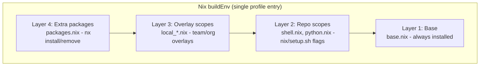

# Customization

The tool is designed for customization at three levels - from individual developers adding a package to organizations distributing standardized environments - without forking the base repository.

## Package layers

Packages are assembled from four layers, evaluated bottom-up by the Nix flake. All layers merge into a single `buildEnv` - one nix profile entry, one `nix profile upgrade` to apply. No layer can shadow or break another.



| Layer              | What                                           | How                                 | Who        |
| ------------------ | ---------------------------------------------- | ----------------------------------- | ---------- |
| **Base**           | Core tools (git, jq, curl, coreutils)          | Always included, cannot be disabled | Base repo  |
| **Repo scopes**    | Curated groups (shell, python, k8s, terraform) | `nix/setup.sh --shell --python`     | Base repo  |
| **Overlay scopes** | Custom groups (team CLIs, org utilities)       | `nx scope add` or overlay directory | Team / org |
| **Extra packages** | Individual tools                               | `nx install httpie`                 | Individual |

## Adding packages (layer 4)

The simplest way - no scopes, no files to edit:

```bash
nx install httpie jq       # validates against nixpkgs, installs immediately
nx remove httpie           # remove a package
nx list                    # see everything installed, annotated by layer
```

Package names are validated against nixpkgs before being added. Typos and non-existent packages are caught immediately. Changes apply without needing `nx upgrade`.

Use this for one-off tools. If you find yourself adding many related packages, consider creating a scope instead.

## Creating custom scopes (layer 3)

Scopes group related packages with a meaningful name:

```bash
# Create a scope and add packages in one step
nx scope add devtools httpie jq bat

# Add more packages to an existing scope
nx scope add devtools fd

# Open a scope in your editor
nx scope edit devtools

# Apply changes after manual edits
nx upgrade
```

The scope file is standard Nix:

```nix
{ pkgs }: with pkgs; [
  bat
  fd
  httpie
  jq
]
```

Scopes created via `nx scope add` live in the overlay directory and are copied into `~/.config/nix-env/scopes/` with a `local_` prefix - preventing name collisions with base repo scopes.

## Overlay directory

The overlay directory is where custom scopes, shell configs, and hooks live. It supports three usage patterns:

| Pattern        | Overlay location                           | Use case                        |
| -------------- | ------------------------------------------ | ------------------------------- |
| Solo developer | `~/.config/nix-env/local/` (default)       | Personal tools and aliases      |
| Team           | Shared git repo via `NIX_ENV_OVERLAY_DIR`  | Team-specific scopes and config |
| Organization   | Org-managed repo via `NIX_ENV_OVERLAY_DIR` | Org-wide standards and hooks    |

### Structure

```text
overlay-dir/
├── scopes/                       # custom scope files (copied as local_*.nix)
│   └── devtools.nix
├── bash_cfg/                     # extra shell config (sourced on login)
│   └── aliases_custom.sh
└── hooks/
    ├── pre-setup.d/              # run before scope resolution
    │   └── check_vpn.sh
    └── post-setup.d/             # run after setup completes
        └── notify_slack.sh
```

- **Scopes** are copied with `local_` prefix during `nix/setup.sh` or `nx scope add`
- **Shell configs** in `bash_cfg/` are sourced alongside standard configs at login
- **Hooks** run during `nix/setup.sh` at the indicated phase, with access to `NIX_ENV_PHASE`, `NIX_ENV_SCOPES`, and `NIX_ENV_PLATFORM`

### Sharing with a team

Point everyone at a shared overlay directory:

```bash
# In ~/.bashrc or ~/.zshenv, before the managed block
export NIX_ENV_OVERLAY_DIR="$HOME/src/team-nix-overlay"
```

The shared repo can contain team-specific scopes, shell aliases, and setup hooks. Individual users can still use `nx install` for personal additions on top.

### Managing overlays

```bash
nx overlay list      # show overlay directory contents
nx overlay status    # show sync status (synced / modified / source missing)
```

## Hooks

Hook scripts (`*.sh`) run at defined phases during `nix/setup.sh`, with access to environment variables:

| Phase      | Directory             | Variables available                              |
| ---------- | --------------------- | ------------------------------------------------ |
| Pre-setup  | `hooks/pre-setup.d/`  | `NIX_ENV_VERSION`, `NIX_ENV_PLATFORM`, `ENV_DIR` |
| Post-setup | `hooks/post-setup.d/` | All above + `NIX_ENV_SCOPES`                     |

Example use cases:

- **VPN check** - verify VPN is connected before setup downloads packages
- **Fleet telemetry** - POST `install.json` to a monitoring endpoint after setup
- **Team pinning** - write `pinned_rev` to lock package versions across a team
- **Compliance** - verify required scopes are present, block setup if missing

## Pinning package versions

By default, `nx upgrade` resolves the latest `nixpkgs-unstable` - a deterministic snapshot of 100k+ packages at specific versions. Each commit is a reproducible state, not a rolling release.

For teams that need coordinated versions:

```bash
nx upgrade           # upgrade and verify everything works
nx pin set           # pin the current (tested) revision
nx pin show          # show current pin
nx pin remove        # go back to latest unstable
```

The pin is stored in `~/.config/nix-env/pinned_rev`. When present, `nx upgrade` locks to that commit instead of resolving the latest. Distribute the pin via a pre-setup hook:

```bash
# overlay-dir/hooks/pre-setup.d/pin_nixpkgs.sh
echo "abc123..." > "$HOME/.config/nix-env/pinned_rev"
```

When IT validates a new nixpkgs revision, they update the hook - everyone gets the tested baseline on next upgrade.

## Upgrades and rollback

```bash
nx upgrade                    # upgrade all packages to latest (or pinned) versions
nx rollback                   # revert to the previous package set
nix profile diff-closures     # see exactly what changed
nx gc                         # clean up old generations
```

Upgrades are atomic - all packages upgrade together through a single `buildEnv`. Rollback reverts the entire environment to the previous state, not individual packages. This eliminates partial upgrade states.

## Quick reference

| Task                         | Command                              |
| ---------------------------- | ------------------------------------ |
| Add a package                | `nx install <pkg>`                   |
| Remove a package             | `nx remove <pkg>`                    |
| List all packages            | `nx list`                            |
| Search nixpkgs               | `nx search <term>`                   |
| Create a scope with packages | `nx scope add <name> <pkg> [pkg...]` |
| Edit a scope file            | `nx scope edit <name>`               |
| Show scope tree              | `nx scope tree`                      |
| List overlay contents        | `nx overlay list`                    |
| Check overlay sync status    | `nx overlay status`                  |
| Upgrade packages             | `nx upgrade`                         |
| Pin current revision         | `nx pin set`                         |
| Show / remove pin            | `nx pin show` / `nx pin remove`      |
| Roll back last upgrade       | `nx rollback`                        |
| See what changed             | `nix profile diff-closures`          |
| Clean up old generations     | `nx gc`                              |
| Run health checks            | `nx doctor`                          |
