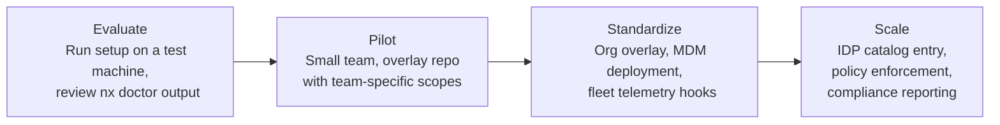

# Enterprise Readiness

An honest assessment of where this tool stands today, what it provides out of the box, and what would need investment - on both the tool side and the enterprise infrastructure side - for full organizational adoption.

## Maturity summary

| Dimension          | Rating               | Detail                                                                       |
| ------------------ | -------------------- | ---------------------------------------------------------------------------- |
| Code quality       | Strong               | 412 test cases, 7 custom pre-commit hooks, ShellCheck, multi-platform CI     |
| Architecture       | Strong               | Phase-separated orchestrator, testable without mocking, documented call tree |
| Cross-platform     | Strong               | macOS (bash 3.2 + BSD), Linux, WSL, Coder - all CI-validated                 |
| Documentation      | Strong               | ARCHITECTURE.md, CONTRIBUTING.md, SUPPORT.md, inline design rationale        |
| Corporate proxy    | Strong               | Automatic MITM detection, CA bundle merging, per-tool env var configuration  |
| Extensibility      | Strong               | Three-tier overlay model, hook system, custom scopes without forking         |
| Upgrade/rollback   | Strong               | Atomic upgrades via Nix, `nx rollback`, `nx pin` for fleet coordination      |
| Fleet telemetry    | Scaffold only        | `install.json` provenance + `nx doctor --json` - consumer not included       |
| MDM integration    | Ready (not included) | Unattended mode works; Determinate Systems provides the MDM installer        |
| Policy enforcement | Extension point      | Hook directories exist; enforcement logic is a downstream concern            |

## What's production-ready today

### Self-contained environment lifecycle

The complete install → configure → upgrade → rollback → uninstall lifecycle works without external dependencies:

- `nix/setup.sh` provisions the environment (one command, idempotent)
- `nx upgrade` / `nx rollback` manage package versions
- `nx doctor --strict` validates environment health
- `nix/uninstall.sh` cleanly removes everything (two-phase: environment-only or full Nix removal, with `--dry-run` preview). CI-validated on every PR - assertions verify that nix-specific config is removed while generic config is preserved

### Organizational customization without forking

The overlay system supports three levels of customization:

- **Base layer** - curated scopes shipped with this repository
- **Overlay layer** - organization or team scopes, shell config, and hooks distributed via `NIX_ENV_OVERLAY_DIR`
- **User layer** - individual packages via `nx install`

An organization can maintain its own overlay repository with custom scopes (internal CLI tools, team-specific packages), shell aliases, and setup hooks - without modifying the base repository. Base updates are pulled independently of overlay changes.

### IDP integration surface

The tool provides building blocks that an Internal Developer Platform can consume:

| Building block     | What it provides                                                | How an IDP consumes it                             |
| ------------------ | --------------------------------------------------------------- | -------------------------------------------------- |
| Version identity   | `NIX_ENV_VERSION`, git tags, `VERSION` file in release tarballs | Catalog entity metadata                            |
| Health checks      | `nx doctor --json`                                              | Monitoring endpoint, fleet health dashboard        |
| Install provenance | `install.json` (version, scopes, timestamp, status)             | Audit trail, compliance reporting                  |
| Hook directories   | `pre-setup.d/`, `post-setup.d/`                                 | Org policy injection without forking               |
| Overlay mechanism  | `NIX_ENV_OVERLAY_DIR`                                           | Scope and config distribution                      |
| Env var namespace  | `NIX_ENV_*` reserved for extensions                             | Enterprise-specific configuration                  |
| Unattended mode    | `--unattended` flag                                             | MDM deployment, Ansible playbooks, Coder templates |

### Certificate and proxy handling

Automatic MITM proxy detection and certificate configuration is production-ready and tested. See [Corporate Proxy](proxy.md) for the full technical flow. This alone saves hours per developer in environments with TLS inspection.

## What needs enterprise investment

### Nix approval (strategic, highest impact)

Nix is the foundational dependency. Before organizational adoption, InfoSec and platform teams need to evaluate:

- **Supply chain:** packages come from `nixpkgs-unstable`, a community-maintained repository. Nix provides reproducible builds and content-addressable storage, but the upstream is not vendor-managed.
- **Network requirements:** Nix downloads from `cache.nixos.org` (binary cache). Air-gapped environments need a local cache or binary mirror.
- **MDM compatibility:** [Determinate Systems](https://determinate.systems/nix/macos/mdm/) provides a commercially supported installer with Jamf/Intune integration - the tool already uses their installer as the recommended method.

**Mitigation:** `nx pin set <rev>` locks all packages to a specific nixpkgs commit SHA. Distributed via overlay hooks, this ensures every developer runs identical, audited package versions. The pin mechanism is already implemented and CI-tested.

### Fleet telemetry

The building blocks exist (`install.json` for provenance, `nx doctor --json` for health), but the consumer - the system that collects, aggregates, and dashboards this data - is an enterprise infrastructure concern. Options:

- **Lightweight:** Post-setup hook that `curl`s provenance to an internal endpoint
- **Full:** Scheduled `nx doctor --json` output to a monitoring system (Datadog, Grafana)

The hook system (`post-setup.d/`) provides the injection point. The telemetry endpoint and data contract are decisions for the platform team.

### Policy enforcement

The overlay hook system provides the mechanism (code runs at defined phases with access to environment variables). Example policies an organization might enforce:

- Minimum tool versions
- Required scopes for specific teams
- Mandatory proxy certificate configuration
- Package allowlists or blocklists

The enforcement logic itself is downstream - it belongs in the organization's overlay repository, not in the base tool.

### Distribution

The tool is currently distributed as a git clone. For enterprise deployment, additional distribution channels may be needed:

- **Release tarballs** - versioned archives for artifact stores (Artifactory, Nexus)
- **MDM scripts** - wrapper scripts for Jamf/Intune that handle the initial Nix install + setup invocation
- **Coder templates** - pre-configured dev container definitions that run setup on workspace creation

The GitHub Actions workflow for release automation (tag → test → build → publish) is designed but not yet implemented.

## Strengths for enterprise adoption

### Solves the hardest problems first

Most environment setup tools handle the easy case (installing packages on a single OS) and ignore the hard cases:

- **MITM proxy certificates** - detected automatically, configured for every tool, persisted across shell sessions. This is the number one developer productivity drain in corporate environments and the problem most tools don't even attempt.
- **WSL environments** - WSL is the most popular development environment on enterprise Windows. It cannot be golden-imaged, its certificate trust store is separate from Windows, and most setup tools don't support it. This tool handles WSL end-to-end, including certificate propagation from the Windows host.
- **Rootless containers** - Coder and devcontainer environments have no root access and no systemd. The tool works without either.

### Engineering discipline as a feature

The tool's own development practices demonstrate the standards it enables:

- 412 test cases covering bash, PowerShell, and integration scenarios
- Custom pre-commit hooks that enforce bash 3.2 compatibility, scope consistency, and documentation quality
- Multi-platform CI that validates every change on macOS and Linux
- Idempotency verified on every pull request

This is not typical for infrastructure tooling. It signals that the tool is maintained to application-grade standards and can be relied upon for production use.

### Clean separation of concerns

The tool does not try to be an IDP, a fleet manager, or a policy engine. It provides:

- A provisioning mechanism (setup)
- A management interface (nx CLI)
- A health check system (nx doctor)
- Extension points (hooks, overlays, env vars)

The enterprise layer - telemetry, policy, distribution, fleet management - is built *on top of* these primitives, not baked into the tool. This separation means the base tool remains simple, testable, and upgradeable, while the enterprise layer can evolve independently.

## Risks and mitigations

| Risk                                              | Severity | Mitigation                                                                                                            |
| ------------------------------------------------- | -------- | --------------------------------------------------------------------------------------------------------------------- |
| Nix not approved by InfoSec                       | High     | Determinate Systems commercial support; `nx pin` for supply chain control; content-addressable store for auditability |
| nixpkgs-unstable drift                            | Medium   | `nx pin set <rev>` locks versions; explicit `--upgrade` required; no silent updates                                   |
| Cognitive load (macOS + WSL + Coder + bash 3.2/5) | Medium   | Phase-separated architecture; each phase independently testable; comprehensive ARCHITECTURE.md                        |
| External GitHub fetch at install time             | Medium   | Release tarballs for air-gapped use; overlay for internal mirrors                                                     |
| macOS MDM conflicts with Nix                      | Low      | Determinate Systems MDM installer designed for managed fleets                                                         |

## Adoption path

Each stage is independently valuable. A single developer benefits from the setup automation. A team benefits from shared scopes and overlays. The organization benefits from fleet visibility and policy enforcement. The tool does not require full organizational commitment to deliver value at each stage.
