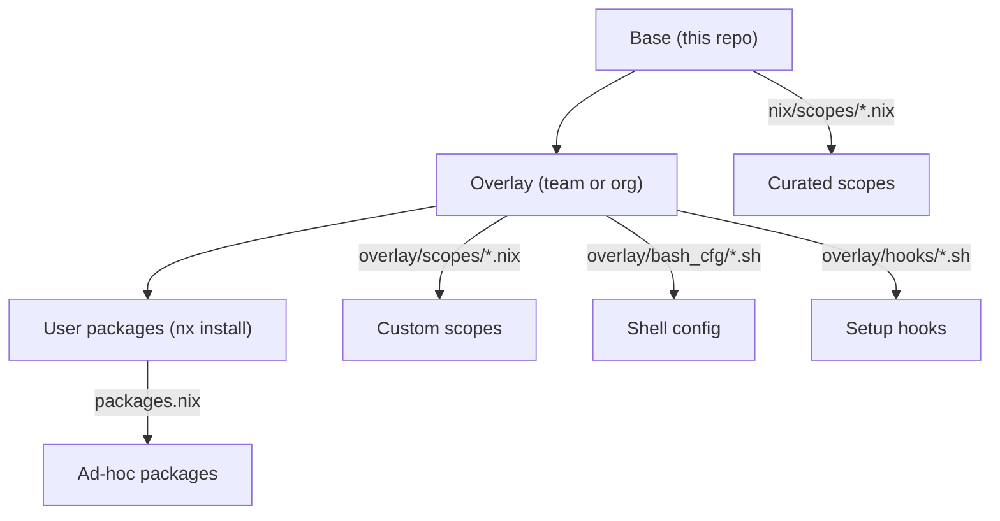
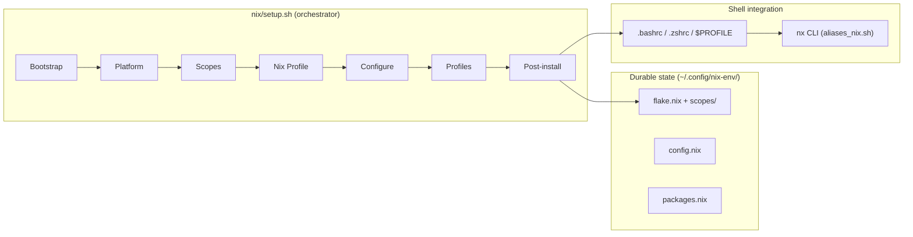

# Dev Environment Setup

**One command to go from a bare machine to a fully configured, standards-compliant development workstation - on macOS, Linux, WSL, or Coder.**

```bash
nix/setup.sh --shell --python --pwsh --k8s-base
```

After setup, the repository clone is disposable. All state lives in `~/.config/nix-env/`, managed by the built-in `nx` CLI:

```bash
nx install httpie       # add a package
nx upgrade              # upgrade all packages
nx rollback             # revert if something breaks
nx doctor               # run health checks
```

## Why this exists

Large engineering organizations without a standard approach to developer workstation setup experience a predictable set of problems:

- **Inconsistent tooling** - developers install tools manually, from different sources, at different versions. "Works on my machine" is a daily conversation. Linting tools, pre-commit hooks, and Makefiles - the building blocks of code quality - remain a rarity because there is no baseline that includes them.

- **SSL/TLS certificate failures** - corporate MITM inspection proxies replace upstream certificates. Every tool that makes HTTPS requests (git, curl, pip, npm, az, terraform) breaks with cryptic SSL errors. Developers lose hours on workarounds that are fragile and tool-specific. See [Corporate Proxy](proxy.md) for how this tool solves it.

- **Platform fragmentation** - some teams use macOS, others run Linux in WSL, cloud environments add a third variant. Each platform has its own package manager, shell configuration conventions, and trust store. Supporting all three is expensive and rarely attempted.

- **No reproducibility** - onboarding a new developer takes hours of manual setup. Rebuilding after a hardware failure repeats the same effort. There is no way to audit what is installed, no rollback path when an upgrade breaks something, and no mechanism to coordinate package versions across a team.

## What it provides

### Standards out of the box

Every installation includes a curated baseline: git with sane defaults, shell aliases, pre-commit tooling, Makefile completion, and consistent shell configuration across bash, zsh, and PowerShell. Teams that adopt this tool inherit a shared vocabulary of commands, aliases, and workflows without additional effort.

### Transparent proxy and certificate handling

Corporate proxy issues are detected and resolved automatically during setup. The tool intercepts MITM proxy certificates, builds a merged CA bundle, and configures every tool that needs it - git, curl, pip, npm, az, terraform, and nix-built binaries - through the correct environment variables. On macOS, certificates are exported directly from the Keychain. See [Corporate Proxy](proxy.md) for the full flow.

### Cross-platform consistency

The same tool, the same scopes, and the same `nx` commands work identically across all supported platforms. Developers switch platforms without learning a new setup process. Teams standardize on a shared configuration regardless of hardware preferences.

| Platform                                       | Entry point         | Root required            | Shell support         |
| ---------------------------------------------- | ------------------- | ------------------------ | --------------------- |
| macOS (Apple Silicon, Intel)                   | `nix/setup.sh`      | One-time for Nix install | bash, zsh, PowerShell |
| Linux (Debian, Ubuntu, Fedora, RHEL, openSUSE) | `nix/setup.sh`      | One-time for Nix install | bash, zsh, PowerShell |
| WSL (Windows Subsystem for Linux)              | `wsl/wsl_setup.ps1` | Windows admin            | bash, zsh, PowerShell |
| Coder / devcontainers                          | `nix/setup.sh`      | None (rootless)          | bash, zsh, PowerShell |

### Declarative and reproducible

The entire environment is defined in Nix scope files - plain text that can be version-controlled, code-reviewed, and audited. `nx pin` coordinates package versions across a team by locking to a specific nixpkgs commit. Every installation writes provenance metadata to `install.json`, enabling fleet-wide visibility into what is deployed where.

### Safe upgrades, rollback, and clean uninstall

`nx upgrade` pulls the latest packages. `nx rollback` reverts to the previous generation if something breaks. `nix profile diff-closures` shows exactly what changed. When the tool is no longer needed, `nix/uninstall.sh` cleanly removes everything it created - nix-specific shell config, aliases, plugins, state directories - while preserving generic configuration (certificates, local PATH) that other tools may depend on. A `--dry-run` flag previews all changes before committing. The entire lifecycle - install, upgrade, rollback, uninstall - is explicit, auditable, and reversible.

## Scope system

Packages are organized into **scopes** - curated groups that can be composed to match a team's technology stack. Scopes are additive: adding a new scope never removes existing tools. Dependencies are resolved automatically (e.g., `k8s-dev` pulls in `k8s-base`).

| Scope       | What it provides                            |
| ----------- | ------------------------------------------- |
| `shell`     | fzf, eza, bat, ripgrep, yq                  |
| `python`    | uv, prek                                    |
| `pwsh`      | PowerShell 7                                |
| `k8s-base`  | kubectl, kubelogin, k9s, kubecolor, kubectx |
| `k8s-dev`   | helm, flux, kustomize, trivy, argo, cilium  |
| `az`        | Azure CLI, azcopy                           |
| `terraform` | terraform, tflint                           |
| `nodejs`    | Node.js                                     |
| `conda`     | Miniforge                                   |
| `docker`    | Docker post-install configuration           |

Prompt engines (oh-my-posh, starship) and additional scopes (gcloud, bun, rice, zsh) are also available. Run `nix/setup.sh --help` for the full list.

## Extensibility

The tool supports customization at three levels without forking:



- **Base layer** - curated scopes shipped with this repository
- **Overlay layer** - team or org customization via `NIX_ENV_OVERLAY_DIR`, survives base upgrades
- **User layer** - individual packages via `nx install`

See [Customization](customization.md) for the full guide.

## Engineering quality

This is not a shell script collection. It is infrastructure that developers depend on to work - and it is tested accordingly.

| Metric                  | Value                                                               |
| ----------------------- | ------------------------------------------------------------------- |
| Unit test cases         | 412 (13 bats + 9 Pester test files)                                 |
| Custom pre-commit hooks | 7 (bash 3.2 enforcer, scope validator, smart test runner, and more) |
| CI matrix               | macOS Sequoia + Tahoe, Ubuntu daemon + rootless                     |
| Idempotency             | Verified on every PR - second run produces identical results        |
| Install provenance      | Every run writes `install.json` with version, scopes, status        |
| Uninstall               | Two-phase cleanup with dry-run mode                                 |

See [Quality & Testing](standards.md) for the full breakdown.

## Architecture at a glance



The orchestrator is a slim ~110-line bash script that sources phase libraries in sequence. Each phase is independently testable - side-effecting operations are called through thin wrappers that tests override, no mocking frameworks required.

See [Architecture](architecture.md) for the full reference and [Design Decisions](decisions.md) for the reasoning behind key choices.

## Getting started

=== "WSL (Windows)"

    Run from **PowerShell on the Windows host**. The script installs the WSL distro if needed, sets up Nix inside it, and provisions the environment end-to-end - including certificate propagation from Windows:

    ```powershell
    git clone https://github.com/szymonos/linux-setup-scripts.git
    cd linux-setup-scripts
    wsl/wsl_setup.ps1 'Ubuntu' -Nix -s @('shell', 'python', 'pwsh')
    ```

=== "macOS"

    Nix is installed automatically by `nix/setup.sh` via the [Determinate Systems](https://determinate.systems/) installer if not already present - no manual pre-installation needed:

    ```bash
    git clone https://github.com/szymonos/linux-setup-scripts.git
    cd linux-setup-scripts
    nix/setup.sh --shell --python --pwsh
    ```

=== "Coder / containers"

    For rootless environments where Nix is pre-installed (no daemon, no root). The same `nix/setup.sh` works without any special flags using the upstream installer with `--no-daemon` flag:

    ```bash
    git clone https://github.com/szymonos/linux-setup-scripts.git
    cd linux-setup-scripts
    nix/setup.sh --shell --python --pwsh
    ```

After setup, the repository clone can be removed - the environment is fully self-contained in `~/.config/nix-env/`.
