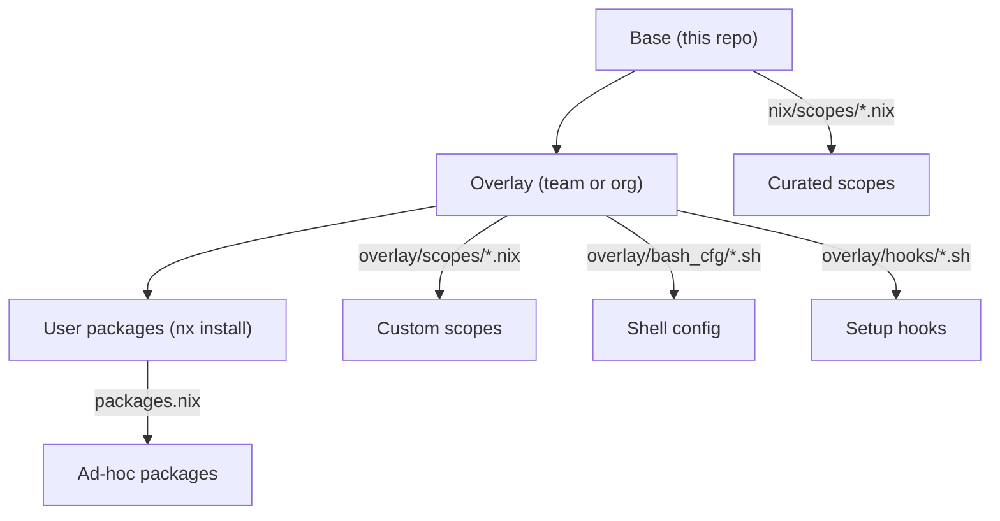
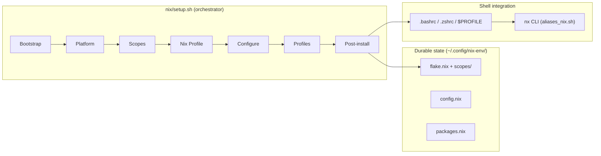

# Dev Environment Setup

**Universal, cross-platform developer environment provisioning.** One command to go from a bare machine to a fully configured, standards-compliant development workstation - on macOS, Linux, WSL, or cloud-based environments like Coder.

## The problem

Large engineering organizations often lack a standard approach to developer workstation setup. Without one, teams experience a predictable set of friction points:

- **Inconsistent tooling** - developers install tools manually, from different sources, at different versions. "Works on my machine" becomes a daily conversation. Linting tools, pre-commit hooks, and Makefiles - the foundational building blocks of code quality - remain a rarity because there is no baseline that includes them.
- **SSL/TLS certificate failures** - corporate MITM inspection proxies replace upstream certificates. Every tool that makes HTTPS requests (git, curl, pip, npm, az, terraform) breaks with cryptic SSL errors. Developers lose hours searching for workarounds, and the solutions they find are fragile and tool-specific.
- **Platform fragmentation** - some teams use macOS, others run Linux in WSL, and cloud development environments add a third variant. Each platform has its own package manager, shell configuration conventions, and trust store. Supporting all three is expensive and rarely attempted.
- **No reproducibility** - without a declarative approach, onboarding a new developer takes hours of manual setup. Rebuilding after a hardware failure or OS reinstall repeats the same effort. There is no way to audit what is installed, no rollback path when an upgrade breaks something, and no mechanism to coordinate package versions across a team.

## The solution

This tool provides a **single, declarative entry point** that provisions a complete development environment. It uses [Nix](https://nixos.org/) as a cross-platform package manager - not requiring root after initial setup - and wraps it with an opinionated but extensible configuration layer.

```bash
# Install everything with one command
nix/setup.sh --shell --python --pwsh --k8s-base
```

After setup, a built-in CLI (`nx`) manages the environment without needing the repo:

```bash
nx install httpie       # add a package (validated against nixpkgs)
nx upgrade              # upgrade all packages to latest
nx rollback             # revert if something breaks
nx doctor               # run health checks
```

## Key benefits

### Standards out of the box

Every installation includes a curated baseline: git with sane defaults, shell aliases, pre-commit tooling (via prek), Makefile completion, and consistent shell configuration across bash, zsh, and PowerShell. Teams that adopt this tool inherit a shared vocabulary of commands, aliases, and workflows without additional effort.

### Transparent proxy and certificate handling

Corporate proxy issues are detected and resolved automatically during setup. The tool intercepts MITM proxy certificates, builds a merged CA bundle, and configures every tool that needs it - git, curl, pip, npm, az, terraform, and nix-built binaries - through the correct environment variables. On macOS, certificates are exported directly from the Keychain. No manual `openssl s_client` debugging required. See [Corporate Proxy](corporate_proxy.md) for details.

### Cross-platform consistency

The same tool, the same scopes, and the same `nx` commands work identically on macOS (Apple Silicon and Intel), Linux (Debian, Ubuntu, Fedora, RHEL, openSUSE), WSL, and Coder/devcontainer environments. Developers can switch platforms without learning a new setup process, and teams can standardize on a shared configuration regardless of hardware preferences.

### Declarative and reproducible

The entire environment is defined in Nix scope files - plain text that can be version-controlled, code-reviewed, and audited. `nx pin` coordinates package versions across a team by locking to a specific nixpkgs commit. Every installation writes provenance metadata (version, scopes, timestamp, status) to `install.json`, enabling fleet-wide visibility into what is deployed where.

### Self-contained after setup

After the initial `nix/setup.sh` run, the repository clone is disposable. All durable state lives in `~/.config/nix-env/` - flake declarations, scope definitions, shell configs, health checks, and the uninstaller. The `nx` CLI operates entirely on this local state. No server, no agent, no runtime dependency on the source repository.

### Safe upgrades and rollback

`nx upgrade` pulls the latest packages. `nx rollback` reverts to the previous generation if something breaks. `nix profile diff-closures` shows exactly what changed. `nx gc` cleans up old generations when ready. The entire lifecycle is explicit, auditable, and reversible.

## Platform support

| Platform                                       | Entry point         | Root required            | Shell support         |
| ---------------------------------------------- | ------------------- | ------------------------ | --------------------- |
| macOS (Apple Silicon, Intel)                   | `nix/setup.sh`      | One-time for Nix install | bash, zsh, PowerShell |
| Linux (Debian, Ubuntu, Fedora, RHEL, openSUSE) | `nix/setup.sh`      | One-time for Nix install | bash, zsh, PowerShell |
| WSL (Windows Subsystem for Linux)              | `wsl/wsl_setup.ps1` | Windows admin            | bash, zsh, PowerShell |
| Coder / devcontainers                          | `nix/setup.sh`      | None (rootless)          | bash, zsh, PowerShell |

## Scope system

Packages are organized into **scopes** - curated groups that can be composed to match a team's technology stack. Scopes are additive: adding a new scope never removes existing tools.

| Scope       | What it provides                            |
| ----------- | ------------------------------------------- |
| `shell`     | fzf, eza, bat, ripgrep, yq                  |
| `python`    | uv, prek                                    |
| `pwsh`      | PowerShell 7                                |
| `k8s-base`  | kubectl, kubelogin, k9s, kubecolor, kubectx |
| `k8s-dev`   | helm, flux, kustomize, trivy, argo, cilium  |
| `az`        | Azure CLI, azcopy                           |
| `terraform` | terraform, tflint                           |
| `nodejs`    | Node.js                                     |
| `conda`     | Miniforge                                   |
| `docker`    | Docker post-install configuration           |

Prompt engines (oh-my-posh, starship) and additional scopes (gcloud, bun, rice) are also available. Run `nix/setup.sh --help` for the full list.

## Extensibility model

The tool is designed for customization at three levels without forking:



- **Base layer** - curated scopes and core tools shipped with this repository. Updated by pulling new versions.
- **Overlay layer** - a separate directory (team git repo, org-managed path, or local `~/.config/nix-env/local/`) containing custom scopes, shell aliases, and setup hooks. Survives base upgrades. Distributed by pointing `NIX_ENV_OVERLAY_DIR` to a shared location.
- **User layer** - individual packages added via `nx install`. Stored in `packages.nix` alongside the scopes.

This model supports solo developers, team-wide standardization, and organization-level distribution without any changes to the base repository. See [Customization](customization.md) for details.

## Enterprise readiness

### IDP integration surface

The tool is designed as a catalog entity for Internal Developer Platforms. It provides the building blocks that an IDP integration consumes:

- **Version identity** - git tags, `NIX_ENV_VERSION`, release tarballs for artifact stores
- **Health checks** - `nx doctor --json` output consumable by monitoring systems
- **Install provenance** - `install.json` for audit trails and fleet dashboards
- **Hook directories** - org customization without forking the base repository
- **Overlay mechanism** - `NIX_ENV_OVERLAY_DIR` for org-level scope and config injection
- **Managed env var namespace** - `NIX_ENV_*` reserved for enterprise extensions

### Unattended deployment

The `--unattended` flag skips all interactive prompts, enabling integration with MDM tools (Jamf, Intune), Ansible playbooks, Coder templates, and CI pipelines:

```bash
nix/setup.sh --all --unattended
```

### Fleet-wide coordination

`nx pin` locks package versions to a specific nixpkgs commit. Distributed via a shared overlay hook, this ensures every developer on a team runs identical tool versions - regardless of when they last upgraded.

### Tested in CI

Every change is validated by GitHub Actions across multiple deployment targets:

| Scenario                                        | Runner           |
| ----------------------------------------------- | ---------------- |
| Multi-user Nix (Linux, WSL, macOS equivalent)   | Ubuntu, macOS 15 |
| Single-user rootless Nix (Coder, devcontainers) | Ubuntu           |
| Apple Silicon macOS                             | macOS 15         |
| Bash 3.2 + BSD sed constraints                  | macOS            |
| Pre-commit hooks, ShellCheck, bats/Pester tests | Ubuntu           |

## Architecture at a glance



The orchestrator is a slim ~110-line bash script that sources phase libraries in sequence. Each phase is independently testable. Side-effecting operations (nix commands, git clones, script invocations) are called through thin wrappers that tests can override - no mocking frameworks required.

See [Architecture](architecture.md) for the full reference.

## Getting started

```bash
# 1. Install Nix (one-time, requires root/admin)
curl --proto '=https' --tlsv1.2 -sSf -L https://install.determinate.systems/nix | sh -s -- install

# 2. Clone and run
git clone https://github.com/szymonos/linux-setup-scripts.git
cd linux-setup-scripts
nix/setup.sh --shell --python --pwsh

# 3. Restart your shell
exec $SHELL
```

After setup, the repository clone can be removed - the environment is fully self-contained in `~/.config/nix-env/`.
