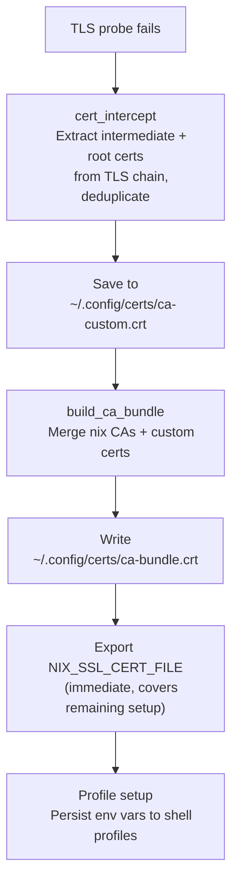

# Corporate Proxy & Certificates

Corporate MITM (man-in-the-middle) TLS inspection proxies are the single biggest source of developer friction in enterprise environments. Every tool that makes HTTPS requests - git, curl, pip, npm, az, terraform - breaks with cryptic SSL errors. Developers lose hours searching for tool-specific workarounds, and the solutions they find are fragile and incomplete.

This tool detects and resolves MITM proxy issues automatically during setup. No manual `openssl s_client` debugging required.

## The problem in detail

TLS inspection proxies replace upstream SSL certificates with ones signed by a corporate CA. This works transparently for browsers (which trust the system CA store), but breaks developer tools in three ways:

1. **Nix-installed binaries** are built against Nix's own OpenSSL and ship with an isolated Mozilla CA bundle. They do not consult the macOS Keychain or the Linux system CA store. A proxy cert trusted by the OS is invisible to nix-installed git, curl, and every other tool.

2. **Python tools** (pip, requests, azure-cli) use `certifi`, a vendored CA bundle that ignores the system store. Each virtualenv gets its own copy.

3. **Node.js tools** (npm, pre-commit hooks) use Node's built-in CA bundle by default, separate from the system store.

The result: the same certificate must be configured in multiple places, through different mechanisms, for different tools - and the configuration must survive shell restarts, virtualenv creation, and environment upgrades.

## How it works

### Automatic detection

When `nix/setup.sh` runs, it probes a TLS endpoint (default: `https://www.google.com`). If the connection fails due to SSL verification, a MITM proxy is assumed and the certificate interception flow runs automatically:



On macOS, certificates are exported directly from the Keychain - capturing any corporate CA certificates that IT has already deployed via MDM.

### What gets configured

The profile setup scripts automatically export environment variables into bash, zsh, and PowerShell profiles. Each variable targets a specific tool ecosystem:

| Variable                             | Used by              | Points to       | Why this file                                                         |
| ------------------------------------ | -------------------- | --------------- | --------------------------------------------------------------------- |
| `NIX_SSL_CERT_FILE`                  | All nix-built tools  | `ca-bundle.crt` | Nix tools ignore the OS store; need a complete replacement bundle     |
| `NODE_EXTRA_CA_CERTS`                | Node.js, npm         | `ca-custom.crt` | Node already trusts system CAs; only needs the additional proxy certs |
| `REQUESTS_CA_BUNDLE`                 | Python requests, pip | `ca-bundle.crt` | Python replaces (not extends) its default store with this variable    |
| `SSL_CERT_FILE`                      | OpenSSL-based tools  | `ca-bundle.crt` | Same replacement behavior as Python                                   |
| `UV_SYSTEM_CERTS`                    | uv, uvx              | n/a (flag)      | Tells uv to use the platform's native certificate store               |
| `CLOUDSDK_CORE_CUSTOM_CA_CERTS_FILE` | Google Cloud CLI     | `ca-bundle.crt` | gcloud has its own cert configuration                                 |

All exports are guarded at runtime - variables are only set if the cert file still exists when the shell starts.

### Certificate storage

| Location                        | Purpose                                    | Created by        |
| ------------------------------- | ------------------------------------------ | ----------------- |
| `~/.config/certs/ca-custom.crt` | Intercepted proxy certs only               | `cert_intercept`  |
| `~/.config/certs/ca-bundle.crt` | Full CA bundle (system CAs + custom certs) | `build_ca_bundle` |

On Linux, `ca-bundle.crt` symlinks to the system bundle (which includes any custom certs added via `update-ca-certificates`). On macOS, it is a merged file combining the nix-provided CA bundle with Keychain-exported and intercepted proxy certs.

### VS Code Server

VS Code Server (remote-SSH, WSL) does not source `~/.bashrc` on startup, so shell-profile environment variables are invisible to extensions. This causes `SELF_SIGNED_CERT_IN_CHAIN` errors in extensions that call HTTPS APIs (GitHub Actions, GitHub Pull Requests, etc.).

The setup automatically writes `NODE_EXTRA_CA_CERTS` to `~/.vscode-server/server-env-setup` - a file VS Code Server sources before launching. This handles the bootstrapping problem where setup runs before the first VS Code remote session.

## Shell functions for ongoing management

After setup, two functions are available for ongoing certificate management:

### `cert_intercept`

Connects to hosts, extracts intermediate and root certificates from the TLS chain (skipping the leaf cert), deduplicates by serial number, and appends new certs to `~/.config/certs/ca-custom.crt`.

```bash
cert_intercept                                      # default host (www.google.com)
cert_intercept login.microsoftonline.com pypi.org   # specific hosts
```

Useful when different proxies serve different certificate chains (e.g., VPN vs. office network).

### `fixcertpy`

Patches Python's `certifi` CA bundle(s) with certs from `~/.config/certs/ca-custom.crt`. Needed because each Python virtualenv gets its own copy of certifi's CA bundle.

```bash
fixcertpy                        # auto-discover and patch all certifi bundles
fixcertpy /path/to/cacert.pem    # patch a specific bundle
```

Idempotent - running it twice does not duplicate certificates.

## WSL integration

When provisioning WSL via PowerShell, the `-AddCertificate` flag intercepts proxy certificates and installs them into the distro's system CA store:

```powershell
wsl/wsl_setup.ps1 'Ubuntu' -AddCertificate
```

This installs the intercepted root cert system-wide (`/usr/local/share/ca-certificates/` on Debian/Ubuntu, `/etc/pki/ca-trust/source/anchors/` on Fedora), so both system tools and nix tools trust it.

## Build system support

The `Makefile` handles MITM proxies for development workflows:

- `PREK_NATIVE_TLS=1` - tells the pre-commit runner to use the system's OpenSSL (which trusts the proxy cert)
- `NODE_EXTRA_CA_CERTS` - automatically set for Node.js-based hooks (markdownlint, cspell) when a custom CA certificate is present
- Docker test targets (`make test-nix`, `make test-legacy`) - auto-intercept the root cert and inject it into the build context

Developers behind corporate proxies don't need special configuration - the build system handles it.

## Troubleshooting

**"unable to get local issuer certificate"** (curl, git)

Run `cert_intercept` and verify the cert was added. For system-wide trust (requires root):

```bash
# Debian/Ubuntu
sudo cp ~/.config/certs/ca-custom.crt /usr/local/share/ca-certificates/proxy-ca.crt
sudo update-ca-certificates

# Fedora/RHEL
sudo cp ~/.config/certs/ca-custom.crt /etc/pki/ca-trust/source/anchors/proxy-ca.crt
sudo update-ca-trust
```

**"CERTIFICATE_VERIFY_FAILED"** (Python, pip, az)

Run `fixcertpy` or verify `REQUESTS_CA_BUNDLE` is set:

```bash
echo $REQUESTS_CA_BUNDLE    # should point to ~/.config/certs/ca-bundle.crt
fixcertpy                    # auto-patch all certifi bundles
```

### Pre-commit hooks fail with SSL errors

Run hooks via `make lint` - the Makefile sets the required environment variables automatically. If running hooks outside of `make`, set `PREK_NATIVE_TLS=1` and `NODE_EXTRA_CA_CERTS` manually.
