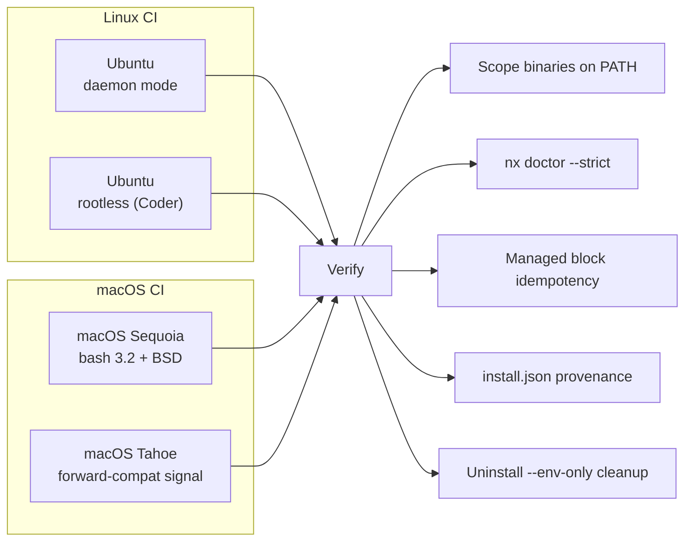

# Quality & Testing

This tool provisions developer environments - if it breaks, developers cannot work. The engineering standards applied to this repository reflect that criticality. This page documents how the codebase enforces its own quality, not as convention, but as automated, CI-validated constraints.

## By the numbers

| Metric                       | Value                                                        |
| ---------------------------- | ------------------------------------------------------------ |
| Unit test files              | 22 (13 bats + 9 Pester)                                      |
| Individual test cases        | 412                                                          |
| Test code                    | 5,400+ lines                                                 |
| Custom pre-commit hooks      | 7 Python scripts                                             |
| CI matrix axes               | 4 (Linux daemon, Linux rootless, macOS Sequoia, macOS Tahoe) |
| Platforms validated per PR   | macOS (bash 3.2 + BSD), Ubuntu (bash 5 + GNU)                |
| Pre-commit checks per commit | 18 hooks                                                     |

## Test infrastructure

### Unit tests - bash (bats)

13 bats test files cover the core logic: scope dependency resolution, `nx` CLI commands (pin, rollback, scope, install, remove), managed block injection and removal, profile migration, overlay system, health checks, and certificate handling.

Phase functions from `nix/lib/phases/` are tested by sourcing them directly and overriding side-effect wrappers:

```bash
setup() {
  source "$REPO_ROOT/nix/lib/io.sh"
  source "$REPO_ROOT/nix/lib/phases/nix_profile.sh"
  # override side effects AFTER sourcing
  _io_nix() { echo "nix $*" >>"$BATS_TEST_TMPDIR/nix.log"; }
}

@test "nix_profile: apply runs profile add and upgrade" {
  phase_nix_profile_apply
  grep -q 'nix profile add' "$BATS_TEST_TMPDIR/nix.log"
}
```

No mocking framework, no external dependencies. Functions call `_io_nix`, `_io_run`, `_io_curl_probe` instead of raw commands. Tests redefine these - three lines per test, zero framework overhead. The pattern is self-documenting and works identically on bash 3.2 and bash 5.

### Unit tests - PowerShell (Pester)

9 Pester test files mirror the bash coverage for PowerShell components: WSL orchestration, scope parsing, certificate conversion, configuration helpers, and `nx` CLI PowerShell equivalents.

### Integration tests - CI

GitHub Actions workflows run the full setup end-to-end on real operating systems:



Each CI run validates:

- Setup completes with requested scope flags
- Core binaries (`git`, `gh`, `jq`, `curl`, `openssl`) resolve on PATH
- Scope-specific binaries resolve (mapped from scope flags)
- `nx doctor --strict` passes (warnings and failures both break the build)
- Second run produces exactly one managed block (idempotency)
- `install.json` records `status: success`
- Uninstaller removes nix-env state while preserving generic config

### Docker smoke tests

`make test-nix` and `make test-legacy` build throwaway Docker images that run a full provisioning pass, verify the `nx` CLI, validate `install.json`, and test the uninstaller - all in an isolated container. Slower than unit tests, but catches integration issues that mocking cannot.

## Pre-commit hooks

Every commit passes through 18 hooks. 7 are custom Python scripts purpose-built for this codebase:

| Hook                          | What it enforces                                                                                                                     |
| ----------------------------- | ------------------------------------------------------------------------------------------------------------------------------------ |
| `gremlins-check`              | No unwanted Unicode characters (zero-width spaces, smart quotes, en-dashes) - auto-fixes common substitutions                        |
| `validate-docs-words`         | Custom dictionary (`project-words.txt`) contains only words that appear in docs - removes stale entries automatically                |
| `align-tables`                | Markdown tables are column-aligned (auto-fixes on save)                                                                              |
| `validate-scopes`             | `scopes.json` and `nix/scopes/*.nix` are consistent - every scope has a matching `.nix` file with a `# bins:` declaration            |
| `check-bash32`                | Nix-path scripts contain no bash 4+ constructs - 14 rules covering mapfile, associative arrays, namerefs, GNU sed/grep extensions    |
| `bats-tests` / `pester-tests` | Smart test runners that parse `source` directives to map changed files to their tests - only runs relevant tests, not the full suite |

Documentation build validation (`mkdocs build --strict`) runs in the CI pipeline rather than as a pre-commit hook, since it requires the full docs dependency set.

External hooks add standard checks: ShellCheck (shell static analysis), markdownlint, cspell (spell checking on docs and commit messages), ruff (Python lint and format), executable/shebang validation, line ending normalization.

## Enforced constraints

### Bash 3.2 compatibility

Not documented as a guideline - enforced by `check_bash32.py` at commit time and validated by macOS CI at merge time. The hook scans for 14 categories of bash 4+ constructs and blocks the commit with line numbers and explanations. Developers get immediate, actionable feedback before the code leaves their machine.

### Scope consistency

`validate_scopes.py` ensures that adding a new scope is a complete operation: the JSON definition, the Nix package list, the dependency rules, and the binary declarations must all be consistent. A partial addition is caught at commit time, not at runtime on a developer's machine.

### Idempotency

CI explicitly validates that running `nix/setup.sh` twice produces identical results - no duplicate managed blocks, no accumulated profile entries, no leftover state. This is verified on every pull request, not assumed.

### Install provenance

Every setup run (success or failure) writes `install.json` with version, scopes, timestamp, and exit status. CI validates this file exists and contains the expected values. This enables fleet-wide auditing: which developers have which versions, when they last ran setup, and whether it succeeded.

## Development workflow

```bash
make install     # install pre-commit hooks (one-time)
make lint        # run hooks on changed files (before every commit)
make test-unit   # bats + Pester unit tests (fast, no Docker)
make test        # all tests including Docker smoke tests
make lint-diff   # hooks on files changed since main
make mkdocs-serve # live-reload documentation preview
```

The `Makefile` handles MITM proxy support automatically: it sets `PREK_NATIVE_TLS` for the pre-commit runner and `NODE_EXTRA_CA_CERTS` for Node.js-based hooks (markdownlint, cspell) when a custom CA certificate is present. Developers behind corporate proxies don't need special configuration - the build system handles it.
