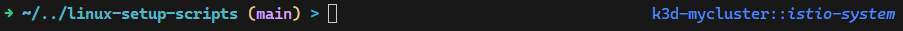
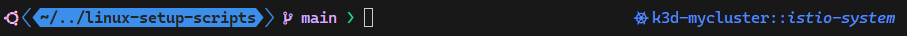
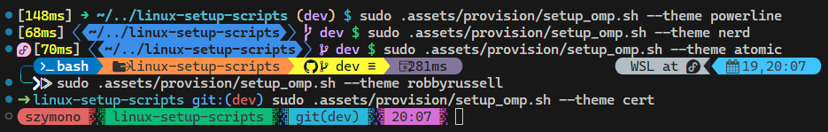

# WSL Setup Guideline

Windows Subsystem for Linux is a very convenient technology to use Linux OS on Windows. It offers many advantages over classic VMs:

- system interop - it offers running Windows programs from the WSL and vice-versa when used on WSLg,
- GPU and CUDA acceleration on WSLg,
- close to bare-metal performance thanks to using Hyper-V type 1 hypervisor,
- automount - direct access to Windows filesystem from WSL and vice-versa,  
- port forwarding to the Windows host - web applications running inside WSL can be accessed directly from Windows web browsers.
- ease of use and fast provisioning times measured in seconds.

## Prerequisites

You can install all the required features/tools by running below commands in terminal:

``` powershell
# Windows Subsystem for Linux - may require rebooting the system afterwards
wsl --install

# PowerShell Core - WSL provisioning scripts need to be executed in PowerShell Core
wsl/pwsh_setup.ps1

# Git distributed version control system
winget install --id Git.Git

# Other usefull tools/applications
winget install --id Microsoft.WindowsTerminal
winget install --id Microsoft.VisualStudioCode
winget install --id gerardog.gsudo
```

## Setting up the WSL distro

### Setup script

To set up specified WSL distro you can use the [wsl/wsl_setup.ps1](wsl/wsl_setup.ps1) script. Assuming, that you're using the default *Ubuntu* distro, you can run the script using the command:

``` powershell
wsl/wsl_setup.ps1 'Ubuntu'
```

It will just update the distro, install developer tools, other base packages (e.g. git, jq, tar, vim) and other determined **setup scopes**.

To install other *features* you need to specify the list of **setup scopes** using `-Scope` parameter. Available scopes are:

- `az`: azure-cli if python scope specified, do-az from ps-modules if shell scope specified.

- `distrobox`: podman, distrobox

- `docker`: docker, containerd, buildx, docker-compose
  > enables systemd on distros where it is not enabled by default

- `k8s_base`: kubectl, helm, minikube, k3d, k9s, yq

- `k8s_ext`: flux, kubeseal, kustomize, argorollouts-cli

- `python`: python-pip, python-venv, miniconda

- `shell`: bat, exa, oh-my-posh, pwsh, ripgrep; bash and pwsh profiles, aliases and PS modules

To set up distro using the specified scopes you need to run the command:

``` powershell
# use the recommended 'shell' scope
wsl/wsl_setup.ps1 'Ubuntu' -Scope 'shell'
# use list of scopes for the setup
wsl/wsl_setup.ps1 'Ubuntu' -Scope @('python', 'shell')
```

### Set up distro with oh-my-posh prompt theme engine

You can opt to use a very powerful oh-my-posh prompt theme engine, by specifying `-OmpTheme` parameter with the name of the theme.

To utilize oh-my-posh theme, the `shell` scope is required to modify shell profiles, but you don't have to specify it, as it will be
automatically added for the **full shell experience**.

``` powershell
# you can omit the shell scope, as it will be added automatically when OmpTheme is specified
wsl/wsl_setup.ps1 'Ubuntu' -OmpTheme 'base'
```

There are three themes included in the repository:

- `base` - using standard, preinstalled fonts  
  
- `powerline` - using extended, powerline fonts, e.g. **Cascadia Code PL** fonts, to be downloaded from [microsoft/cascadia-code](https://github.com/microsoft/cascadia-code)  
  
- `nerd` - using nerd fonts - can be downloaded manually from [ryanoasis/nerd-fonts](https://github.com/ryanoasis/nerd-fonts) or installed using the script [install_fonts_nerd.ps1](../.assets/scripts/nerd_fonts_install.ps1)  
  

You can also specify any other theme name from [Themes | Oh My Posh](https://ohmyposh.dev/docs/themes) - it will be downloaded and installed automatically during the provisioning.

It is also possible to easily change the oh-my-posh theme using the `.assets/provision/setup_omp.sh` script:

``` shell
# setup oh-my-posh theme using default base fonts
sudo .assets/provision/setup_omp.sh
# setup oh-my-posh theme using powerline fonts
sudo .assets/provision/setup_omp.sh --theme powerline
# setup oh-my-posh theme using nerd fonts
sudo .assets/provision/setup_omp.sh --theme nerd
# specify any theme from https://ohmyposh.dev/docs/themes/ (e.g. atomic)
sudo .assets/provision/setup_omp.sh --theme atomic
```



### Fixing self-signed certificate in the chain

Many companies are using corporate MITM proxies with self-signed certificates which causes a lot of connectivity issues.

You can specify the `-AddCertificate` parameter to the **wsl_setup** script to intercept self-signed certificates from the SSL chain and install them in the WSL and eventually other installed packages, e.g. azure-cli, which requires it to be set up independently.

``` powershell
wsl/wsl_setup.ps1 'Ubuntu' -AddCertificate
```

### Using other packages scopes

Depending on the use case you can install many other package `scopes` to further customize the system.
Examples of the most common setup scopes:

``` powershell
# generic setup with omp theme, 'az' scope for the Azure Cloud and Python virtual environments management.
wsl/wsl_setup.ps1 'Ubuntu' -OmpTheme 'base' -Scope @('az', 'python')

# above setup with tools for interacting with externally hosted kubernetes clusters
wsl/wsl_setup.ps1 'Ubuntu' -OmpTheme 'base' -Scope @('az', 'k8s_base', 'python')

# setup with docker and kubernetes stack to experiment with kubernetes clusters using minikube or k3d.
wsl/wsl_setup.ps1 'Ubuntu' -OmpTheme 'base' -Scope @('docker', 'k8s_base', 'k8s_ext')
```

## Update all WSL distros

To update all existing WSL distros just run the command:

``` powershell
wsl/wsl_setup.ps1
```

It will find all installed WSL distros, detect installed **setup scopes** and update them.

## Other WSL distros

By default, the command `wsl --install` installs the Ubuntu distro but there are many other WSL distributions available.  
You can find many of them, like *Debian*, *OpenSUSE*, *AlmaLinux*, *OracleLinux*, *Kali*... in the **Microsoft Store**.  

Other distros can be found on GitHub, e.g. my favorite [WhitewaterFoundry/Fedora-Remix-for-WSL](https://github.com/WhitewaterFoundry/Fedora-Remix-for-WSL) or [sileshn/ArchWSL2](https://github.com/sileshn/ArchWSL2).
